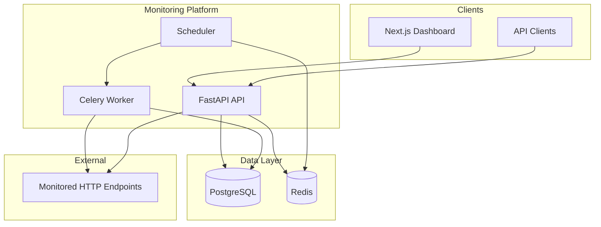

# API Monitoring Platform — Phase 1

Production-grade API monitoring platform (UptimeRobot / Better Uptime style).

## Phase 1 Status

Infrastructure foundation:

- FastAPI application with async SQLAlchemy 2.x
- PostgreSQL models: `users`, `monitors`, `checks`
- Alembic migrations
- Health endpoints (`/health/live`, `/health/ready`)
- Docker Compose (PostgreSQL, Redis, backend, migrate)
- Pytest test suite

## Quick Start

### Local development

```bash
# Start dependencies (PostgreSQL on :5433, Redis on :6380 to avoid local conflicts)
docker compose up -d postgres redis

# Copy environment file
cp .env.example .env

# Install backend dependencies
cd backend
python -m venv .venv && source .venv/bin/activate
pip install -r requirements.txt

# Create test database
docker compose exec postgres psql -U monitoring -c "CREATE DATABASE monitoring_test;"

# Run migrations
alembic upgrade head

# Start API
uvicorn app.main:app --reload --host 0.0.0.0 --port 8000
```

### Docker (full stack)

```bash
cp .env.example .env
docker compose up --build
```

Migrations run via the `migrate` service on startup.

## Database Schema

See `backend/migrations/versions/001_initial_schema.py` for the canonical schema.

### Tables

| Table | Purpose |
|-------|---------|
| `users` | Registered users (auth in Phase 2) |
| `monitors` | HTTP endpoint monitors |
| `checks` | Historical check results |

### Indexes

| Index | Purpose |
|-------|---------|
| `monitors_user_id_idx` | List monitors per user |
| `monitors_enabled_idx` | Filter enabled monitors for scheduling |
| `monitors_next_check_idx` | Find monitors due for execution |
| `checks_monitor_id_checked_at_idx` | Paginated check history (newest first) |

**Note:** `uptime_percentage` is intentionally not stored on monitors. Uptime is derived from `checks` via SQL aggregation (Phase 7).

## Migrations

```bash
cd backend
alembic revision --autogenerate -m "description"
alembic upgrade head
alembic downgrade -1
```

## Testing

```bash
cd backend
pytest -v
```

## Phase 2 Status

Authentication and protected monitor CRUD:

- User registration and login with Argon2 password hashing
- JWT access tokens (`sub`, `role`, `iat`, `exp`)
- `GET /api/v1/auth/me` profile endpoint
- Protected monitor CRUD with server-side ownership enforcement
- `USER` and `ADMIN` roles (`require_admin` dependency ready for Phase 7+)

## API (Phase 1–2)

| Method | Path | Auth | Description |
|--------|------|------|-------------|
| GET | `/health/live` | No | Liveness probe |
| GET | `/health/ready` | No | Readiness (PostgreSQL + Redis) |
| POST | `/api/v1/auth/register` | No | Register user |
| POST | `/api/v1/auth/login` | No | Obtain JWT |
| GET | `/api/v1/auth/me` | Yes | Current user profile |
| POST | `/api/v1/monitors` | Yes | Create monitor |
| GET | `/api/v1/monitors` | Yes | List own monitors |
| GET | `/api/v1/monitors/{id}` | Yes | Get own monitor |
| PATCH | `/api/v1/monitors/{id}` | Yes | Update own monitor |
| DELETE | `/api/v1/monitors/{id}` | Yes | Delete own monitor |
| POST | `/api/v1/monitors/{id}/check` | Yes | Trigger manual HTTP check |
| GET | `/api/v1/monitors/{id}/checks` | Yes | List check history (cursor) |
| GET | `/docs` | No | OpenAPI documentation |

## Phase 3 Status

Asynchronous HTTP monitoring engine:

- Reusable `httpx.AsyncClient` with connection pooling
- `HttpChecker` with monotonic latency measurement
- Normalized error types (TIMEOUT, DNS, SSL, CONNECTION, STATUS_CODE, etc.)
- `MonitoringService` persists `Check` records and updates monitor state
- Manual check: `POST /api/v1/monitors/{id}/check`
- Check history: `GET /api/v1/monitors/{id}/checks` (cursor pagination)

## Phase 4 Status

Background job processing with Celery:

- Celery worker executes `MonitoringService.run_check_by_monitor_id()`
- Scheduler polls due enabled monitors and enqueues tasks
- Redis distributed lock prevents concurrent checks for the same monitor
- Redis pending marker prevents duplicate enqueue while a check is queued
- Docker services: `worker`, `scheduler`

## Phase 5 Status

Reliability layer for monitor checks:

- Exponential backoff with jitter between retry attempts
- Retries only for transient failures (timeouts, connection/DNS errors, 5xx)
- Configurable `MONITOR_RETRY_MAX_ATTEMPTS`, base/max delay, and `MONITOR_FAILURE_THRESHOLD`
- Monitors stay UP until consecutive failures reach the threshold
- Immediate recovery to UP on any successful check
- Each retry attempt persisted as a separate `Check` record

## Phase 6 Status

Security hardening:

- SSRF protection on monitor create/update and before each HTTP check (DNS rebinding defense)
- Redis-backed API rate limiting (per-IP anonymous, per-token authenticated, per-IP login)
- Idempotency for manual checks via `Idempotency-Key` header
- Config: `RATE_LIMIT_*`, `IDEMPOTENCY_TTL_SECONDS`

## Phase 7 Status

Analytics derived from PostgreSQL aggregation on `checks`:

- `GET /api/v1/monitors/{id}/stats?period=1h|24h|7d|30d` — uptime % and latency (latest, avg, min, max, p95)
- `GET /api/v1/dashboard/summary?period=24h` — total/UP/DOWN monitors, overall uptime, average latency
- Uptime formula: `(successful_checks / total_checks) × 100` (null when no checks in window)
- Uses existing `checks_monitor_id_checked_at_idx` for time-windowed queries

## Phase 8 Status

Next.js monitoring dashboard (`frontend/`):

- Pages: `/login`, `/register`, `/dashboard`, `/monitors/new`, `/monitors/[id]`
- JWT auth stored client-side; all data fetched from FastAPI APIs
- Dashboard summary cards + monitor cards with uptime/latency
- Monitor detail: stats by period, latency/availability charts (Recharts), check history
- Manual check trigger and monitor creation/deletion
- Docker service on port `3000`

### Frontend development

```bash
cd frontend
cp .env.example .env.local
npm install
npm run dev
```

Set `NEXT_PUBLIC_API_URL=http://localhost:8000` and ensure the backend is running with CORS enabled.

## Phase 9 Status

Production hardening and operations:

- **Structured JSON logging** via structlog with correlation IDs (`X-Correlation-ID`)
- **Prometheus metrics** at `GET /metrics` (checks, errors, latency, HTTP, worker failures, queue depth)
- **Request logging middleware** with duration and status
- **GitHub Actions CI** (`.github/workflows/ci.yml`): Ruff, MyPy, Pytest, Docker build, frontend lint/build

### Key metrics

| Metric | Description |
|--------|-------------|
| `monitor_checks_total` | Check attempts by source (`api`/`worker`) and result |
| `monitor_check_errors_total` | Failures by error type (TIMEOUT, DNS, etc.) |
| `monitor_check_latency_ms` | Latency histogram for successful checks |
| `worker_task_failures_total` | Celery task exceptions |
| `worker_task_skipped_total` | Skipped tasks (lock held, disabled monitor) |
| `celery_queue_depth` | Pending tasks in the `monitoring` queue |
| `http_requests_total` | API request count by method/path/status |
| `http_request_duration_seconds` | API request latency histogram |

## Architecture



### Request flow

1. **Scheduler** polls due monitors and enqueues Celery tasks (Redis queue + pending marker).
2. **Worker** acquires a per-monitor Redis lock, runs `MonitoringService`, persists checks, updates monitor state.
3. **API** serves CRUD, manual checks, analytics, and auth — all ownership-enforced server-side.
4. **Frontend** is a thin client; no business logic duplicated.

## Deployment

### Docker Compose (recommended for local/staging)

```bash
cp .env.example .env
# Set JWT_SECRET to a long random string in production
docker compose up --build -d
```

| Service | Port | Purpose |
|---------|------|---------|
| `backend` | 8000 | FastAPI API |
| `frontend` | 3000 | Next.js dashboard |
| `postgres` | 5433 | Database (host mapping) |
| `redis` | 6380 | Cache, queue, locks |
| `worker` | — | Celery check execution |
| `scheduler` | — | Due-monitor polling |

### Production checklist

- Set `ENVIRONMENT=production` (disables `/docs`)
- Use strong `JWT_SECRET` (32+ random bytes)
- Configure `CORS_ORIGINS` to your frontend domain only
- Run Postgres and Redis as managed services with persistence
- Scrape `GET /metrics` with Prometheus
- Ship JSON logs to your log aggregator (correlation ID for tracing)
- Bind API to `0.0.0.0:$PORT` behind a reverse proxy with TLS

### Health probes

| Endpoint | Use |
|----------|-----|
| `GET /health/live` | Liveness — process is running |
| `GET /health/ready` | Readiness — PostgreSQL + Redis reachable |
| `GET /metrics` | Prometheus scrape target |

## Failure modes

| Failure | System behavior | Mitigation |
|---------|-----------------|------------|
| **PostgreSQL down** | `/health/ready` returns 503; API cannot persist checks | Restore DB; readiness probe removes instance from load balancer |
| **Redis down** | Rate limiting, locks, queue, idempotency fail; readiness 503 | Restore Redis; workers pause until queue is available |
| **Worker crash mid-check** | Lock TTL expires; pending marker TTL expires; scheduler re-enqueues | Tune `MONITOR_LOCK_TTL_SECONDS`; run multiple workers |
| **Duplicate scheduler/worker** | Redis lock prevents concurrent checks per monitor; pending marker dedupes enqueue | Safe to scale workers horizontally |
| **Target timeout / 5xx** | Retries with exponential backoff; threshold before marking DOWN | Tune retry and `MONITOR_FAILURE_THRESHOLD` |
| **SSRF attempt** | URL blocked at create/update and before each check | Keep SSRF validation enabled; audit blocked URLs in logs |
| **Rate limit exceeded** | 429 with `RATE_LIMIT_EXCEEDED` | Client backoff; raise limits for trusted workloads |
| **JWT expired** | 401 `TOKEN_EXPIRED` | Re-authenticate |
| **Idempotent duplicate** | Cached response or 409 `IDEMPOTENCY_IN_PROGRESS` | Client retries with same `Idempotency-Key` |

## CI

Push to `main`/`master` or open a PR to trigger `.github/workflows/ci.yml`:

1. Backend: Ruff → MyPy → Alembic migrate → Pytest → Docker build
2. Frontend: ESLint → Next.js build

```bash
# Run locally before pushing
cd backend && ruff check app && mypy app && pytest -v
cd frontend && npm run lint && npm run build
```

